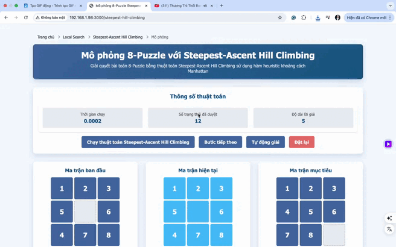
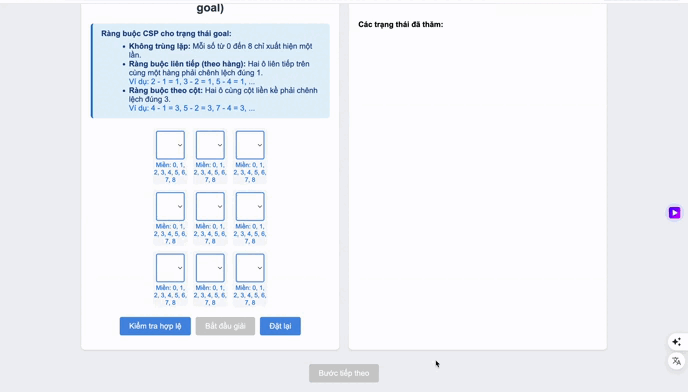
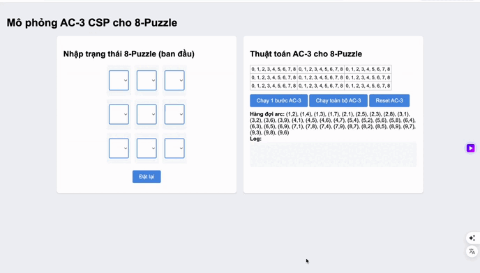

# Dự án Giải Bài Toán 8-Puzzle

## Mục lục
- [1. Mục tiêu](#1-mục-tiêu)
- [2. Nội dung](#2-nội-dung)
  - [2.1. Tìm kiếm không có thông tin](#21-tìm-kiếm-không-có-thông-tin)
  - [2.2. Tìm kiếm có thông tin](#22-tìm-kiếm-có-thông-tin)
  - [2.3. Tìm kiếm cục bộ](#23-tìm-kiếm-cục-bộ)
  - [2.4. Tìm kiếm trong môi trường phức tạp](#24-tìm-kiếm-trong-môi-trường-phức-tạp)
  - [2.5. Tìm kiếm trong môi trường có ràng buộc](#25-tìm-kiếm-trong-môi-trường-có-ràng-buộc)
  - [2.6. Tìm kiếm tăng cường](#26-tìm-kiếm-tăng-cường)
- [3. Kết luận](#3-kết-luận)
  - [Nhận xét tổng quan về các nhóm thuật toán](#nhận-xét-tổng-quan-về-các-nhóm-thuật-toán)
  - [Kết quả đạt được](#kết-quả-đạt-được)
  - [Đề xuất cải tiến](#đề-xuất-cải-tiến)

## 1. Mục tiêu
Triển khai và so sánh hiệu suất của các thuật toán tìm kiếm khác nhau trong việc giải quyết bài toán 8-puzzle, bao gồm:
- Các thuật toán tìm kiếm không có thông tin
- Các thuật toán tìm kiếm có thông tin
- Các thuật toán tìm kiếm cục bộ
- Các thuật toán tìm kiếm trong môi trường phức tạp
- Các thuật toán tìm kiếm trong môi trường có ràng buộc
- Các thuật toán tìm kiếm tăng cường

## 2. Nội dung

### 2.1. Tìm kiếm không có thông tin (Uninformed Search)
**Đặc điểm:** Không sử dụng thông tin heuristic, chỉ dựa vào cấu trúc không gian trạng thái.

**Các thuật toán:**
- **Breadth-First Search (BFS):** Tìm kiếm theo chiều rộng, đảm bảo tìm được đường đi ngắn nhất nhưng tốn nhiều bộ nhớ.
- **Depth-First Search (DFS):** Tìm kiếm theo chiều sâu, tiết kiệm bộ nhớ nhưng không đảm bảo tối ưu.
- **Uniform Cost Search (UCS):** Mở rộng theo chi phí đường đi, đảm bảo tối ưu nếu chi phí các bước khác nhau.
- **Iterative Deepening DFS (IDDFS):** Kết hợp DFS và BFS, tăng dần giới hạn độ sâu.

**Mô phỏng:**
- *Quá trình giải của thuật toán BFS*

- *Quá trình giải của thuật toán DFS*

- *Quá trình giải của thuật toán UCS*

- *Quá trình giải của thuật toán IDDFS*

**So sánh:**
- Thời gian thực thi:
  
- Số nút đã khám phá:
  
- Độ dài đường đi:
  
- Bảng so sánh tóm tắt:
  

**Nhận xét:**
- BFS tối ưu nhưng tốn bộ nhớ
- DFS tiết kiệm bộ nhớ nhưng không tối ưu
- UCS tối ưu với chi phí khác nhau
- IDDFS cân bằng giữa tối ưu và bộ nhớ

### 2.2. Tìm kiếm có thông tin (Informed Search)
**Đặc điểm:** Sử dụng heuristic để hướng dẫn tìm kiếm, tăng hiệu quả.

**Các thuật toán:**
- **Greedy Best-First Search:** Luôn chọn trạng thái có heuristic tốt nhất, nhanh nhưng không tối ưu.
- **A* Search:** Kết hợp chi phí thực tế và heuristic, đảm bảo tối ưu nếu heuristic chấp nhận được.
- **IDA* Search:** Tìm kiếm theo độ sâu với giới hạn dựa trên f-value, tiết kiệm bộ nhớ.

**Mô phỏng:**
- *Quá trình giải của Greedy Best-First Search*

- *Quá trình giải của A* Search*

- *Quá trình giải của IDA* Search*

**So sánh:**
- Thời gian thực thi:
  
- Số nút đã khám phá:
  
- Độ dài đường đi:
  
- Bảng so sánh tóm tắt:
  

**Nhận xét:**
- Greedy nhanh
- A* cân bằng
- IDA* tiết kiệm bộ nhớ

### 2.3. Tìm kiếm cục bộ (Local Search)
**Đặc điểm:** Không quan tâm đến đường đi, chỉ quan tâm trạng thái hiện tại và lân cận.

**Các thuật toán:**
- **Simple Hill Climbing:** Luôn chọn trạng thái lân cận tốt hơn, dễ mắc kẹt cực trị địa phương.
- **Steepest Hill Climbing:** Đánh giá tất cả các lân cận và chọn trạng thái tốt nhất.
- **Simulated Annealing:** Cho phép chọn trạng thái kém hơn với xác suất giảm dần, giúp thoát cực trị địa phương.
- **Stochastic Hill Climbing:** Kết hợp khám phá và khai thác.
- **Beam Search:** Giới hạn số trạng thái xét ở mỗi bước, phù hợp cho giải pháp gần đúng nhanh.

**Mô phỏng:**
- *Quá trình giải của Hill Climbing*

- *Quá trình giải của Steepest Hill Climbing*

- *Quá trình giải của Simulated Annealing*

- *Quá trình giải của Stochastic Hill Climbing*

- *Quá trình giải của Beam Search*

**So sánh:**
- Thời gian thực thi:
  
- Số nút đã khám phá:
  
- Độ dài đường đi:
  
- Bảng so sánh tóm tắt:
  

**Nhận xét:**
- Hill Climbing nhanh nhưng dễ kẹt
- Simulated Annealing hiệu quả hơn
- Local Search phù hợp cho bài toán tối ưu hóa

### 2.4. Tìm kiếm trong môi trường phức tạp (Search in Complex Environments)
**Đặc điểm:** Không gian trạng thái không hoàn toàn quan sát được hoặc có nhiều ràng buộc.

**Các thuật toán:**
- **No Observation Search:** Agent không biết trạng thái hiện tại, duy trì belief state (tập trạng thái có thể).
- **Partial Observation Search:** Agent chỉ biết một phần trạng thái, belief state được cập nhật dựa trên quan sát và hành động.
- **AND-OR Search:** Xử lý các trường hợp không gian trạng thái phân nhánh phức tạp.

**Mô phỏng:**
- *Quá trình giải của AND-OR Search*

- *Quá trình giải của No Observation Search*

- *Quá trình giải của Partial Observation Search*

**Nhận xét:**
- No Observation phù hợp môi trường không biết trước
- Partial Observation cân bằng giữa thu thập thông tin và tối ưu hóa
- AND-OR Search hiệu quả cho bài toán nhiều nhánh quyết định

### 2.5. Tìm kiếm trong môi trường có ràng buộc (Constraint Satisfaction Search)
**Đặc điểm:** Không gian trạng thái bị ràng buộc bởi các điều kiện.

**Các thuật toán:**
- **Forward Checking:** Kiểm tra sớm để giảm không gian tìm kiếm.
- **AC-3:** Duy trì tính nhất quán cục bộ giữa các biến.
- **Backtracking:** Quay lui khi gặp mâu thuẫn.

**Mô phỏng:**
- *Quá trình giải của Forward Checking*

- *Quá trình giải của AC-3*

- *Quá trình giải của Backtracking*

**Nhận xét:**
- Forward Checking và AC-3 hiệu quả cho CSP
- Backtracking đơn giản nhưng có thể chậm

### 2.6. Tìm kiếm tăng cường (Reinforcement Learning Search)
**Đặc điểm:** Agent học từ tương tác với môi trường, tối ưu hóa dần qua trải nghiệm.

**Các thuật toán:**
- **Q-Learning:** Học giá trị hành động-trạng thái qua trải nghiệm.

**Mô phỏng:**
- *Quá trình học tập của Q-Learning*

**Nhận xét:**
- Q-Learning hiệu quả cho không gian trạng thái lớn, cần thời gian huấn luyện

## 3. Kết luận

### Nhận xét tổng quan về các nhóm thuật toán

1. **Tìm kiếm không có thông tin**:
   - Phù hợp khi không có thông tin heuristic
   - BFS và IDDFS là lựa chọn tốt nhất trong nhóm
   - Cần cân nhắc giữa tối ưu và bộ nhớ

2. **Tìm kiếm có thông tin**:
   - Hiệu quả hơn nhờ sử dụng heuristic
   - A* là thuật toán toàn diện nhất
   - Beam Search tốt cho ứng dụng thời gian thực

3. **Tìm kiếm cục bộ**:
   - Nhanh và ít tốn bộ nhớ
   - Simulated Annealing là lựa chọn cân bằng nhất
   - Thích hợp cho bài toán tối ưu hóa

4. **Tìm kiếm trong môi trường phức tạp**:
   - Xử lý tốt môi trường không chắc chắn
   - Partial Observation hiệu quả hơn No Observation
   - Cần chiến lược thu thập thông tin phù hợp

5. **Tìm kiếm có ràng buộc**:
   - Forward Checking và AC-3 hiệu quả cho CSP
   - Cần kết hợp nhiều kỹ thuật để tối ưu
   - Phù hợp cho bài toán lập lịch, quy hoạch

6. **Tìm kiếm tăng cường**:
   - Học từ tương tác với môi trường
   - Hiệu quả cho bài toán dài hạn
   - Cần thời gian huấn luyện

### Kết quả đạt được
1. Triển khai thành công 6 nhóm thuật toán tìm kiếm
2. Xây dựng hệ thống mô phỏng trực quan
3. Phân tích hiệu suất chi tiết
4. Đề xuất các trường hợp sử dụng phù hợp

### Đề xuất cải tiến
1. Tối ưu hóa hiệu suất các thuật toán
2. Thêm các heuristic khác để so sánh
3. Mở rộng cho bài toán N-puzzle
4. Cải thiện giao diện người dùng
