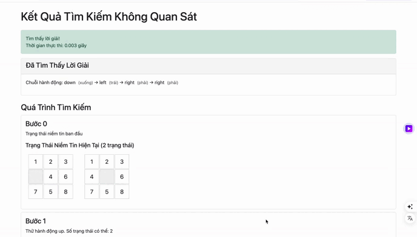

# Dồ án cá nhân Giải Bài Toán 8-Puzzle

## Mục lục
- [1. Mục tiêu](#1-mục-tiêu)
- [2. Nội dung](#2-nội-dung)
  - [2.1. Tìm kiếm không có thông tin](#21-tìm-kiếm-không-có-thông-tin)
  - [2.2. Tìm kiếm có thông tin](#22-tìm-kiếm-có-thông-tin)
  - [2.3. Tìm kiếm cục bộ](#23-tìm-kiếm-cục-bộ)
  - [2.4. Tìm kiếm trong môi trường phức tạp](#24-tìm-kiếm-trong-môi-trường-phức-tạp)
  - [2.5. Tìm kiếm trong môi trường có ràng buộc](#25-tìm-kiếm-trong-môi-trường-có-ràng-buộc)
  - [2.6. Tìm kiếm tăng cường](#26-tìm-kiếm-tăng-cường)
- [3. Kết luận](#3-kết-luận)
  - [Nhận xét tổng quan về các nhóm thuật toán](#nhận-xét-tổng-quan-về-các-nhóm-thuật-toán)
  - [Kết quả đạt được](#kết-quả-đạt-được)
  - [Đề xuất cải tiến](#đề-xuất-cải-tiến)

## 1. Mục tiêu
Triển khai và so sánh hiệu suất của các thuật toán tìm kiếm khác nhau trong việc giải quyết bài toán 8-puzzle, bao gồm:
- Các thuật toán tìm kiếm không có thông tin
- Các thuật toán tìm kiếm có thông tin
- Các thuật toán tìm kiếm cục bộ
- Các thuật toán tìm kiếm trong môi trường phức tạp
- Các thuật toán tìm kiếm trong môi trường có ràng buộc
- Các thuật toán tìm kiếm tăng cường

## 2. Nội dung

### 2.1. Tìm kiếm không có thông tin (Uninformed Search)
**Đặc điểm:** Không sử dụng thông tin heuristic, chỉ dựa vào cấu trúc không gian trạng thái.

**Các thuật toán:**
- **Breadth-First Search (BFS):** Tìm kiếm theo chiều rộng, đảm bảo tìm được đường đi ngắn nhất nhưng tốn nhiều bộ nhớ.
- **Depth-First Search (DFS):** Tìm kiếm theo chiều sâu, tiết kiệm bộ nhớ nhưng không đảm bảo tối ưu.
- **Uniform Cost Search (UCS):** Mở rộng theo chi phí đường đi, đảm bảo tối ưu nếu chi phí các bước khác nhau.
- **Iterative Deepening DFS (IDDFS):** Kết hợp DFS và BFS, tăng dần giới hạn độ sâu.

**Mô phỏng:**
- *Quá trình giải của thuật toán BFS*
  
- *Quá trình giải của thuật toán DFS*
  
- *Quá trình giải của thuật toán UCS*
  
- *Quá trình giải của thuật toán IDDFS*
  

**So sánh:**
- Thời gian thực thi:
  
- Số nút đã khám phá:
  
- Độ dài đường đi:
  
- Bảng so sánh tóm tắt:
  

**Nhận xét chi tiết:**

1. **So sánh về thời gian thực thi:**
   - UCS và IDDFS nhanh nhất (0.0002 giây)
   - BFS cũng rất nhanh (0.0003 giây)
   - DFS chậm nhất, chênh lệch rất lớn (0.0985 giây, gấp khoảng 500 lần các thuật toán khác)

2. **So sánh về số nút khám phá:**
   - BFS khám phá ít nút nhất (19 nút)
   - UCS khám phá 33 nút
   - IDDFS khám phá nhiều hơn (68 nút)
   - DFS khám phá số nút nhiều nhất với sự chênh lệch rất lớn (21329 nút)

3. **So sánh về độ dài đường đi:**
   - BFS, UCS và IDDFS đều cho đường đi tối ưu (5 bước)
   - DFS cho đường đi dài nhất và không tối ưu (25 bước)

**Kết luận:**

1. **Về BFS:**
   - Hiệu quả trong việc tìm đường đi ngắn nhất
   - Khám phá không gian trạng thái một cách có hệ thống
   - Cân bằng tốt giữa thời gian và số nút khám phá

2. **Về DFS:**
   - Hiệu suất kém nhất trong mọi tiêu chí
   - Không đảm bảo tìm được đường đi tối ưu
   - Khám phá quá nhiều nút không cần thiết
   - Không phù hợp cho bài toán tìm đường đi ngắn nhất

3. **Về UCS:**
   - Hiệu quả về thời gian thực thi
   - Số nút khám phá hợp lý
   - Đảm bảo tìm được đường đi tối ưu
   - Phù hợp cho bài toán có chi phí đồng nhất

4. **Về IDDFS:**
   - Kết hợp ưu điểm của DFS và BFS
   - Thời gian thực thi tốt
   - Đảm bảo tìm được đường đi tối ưu
   - Số nút khám phá cao hơn BFS nhưng vẫn trong mức chấp nhận được

**Khuyến nghị sử dụng:**

- **Nên sử dụng:**
  + BFS: Khi cần tìm đường đi ngắn nhất và không gian trạng thái không quá lớn
  + UCS: Khi chi phí các bước đi đồng nhất và cần đảm bảo tối ưu
  + IDDFS: Khi không gian trạng thái lớn và cần đảm bảo tối ưu

- **Không nên sử dụng:**
  + DFS: Không phù hợp cho bài toán tìm đường đi ngắn nhất vì không đảm bảo tối ưu và tốn nhiều tài nguyên

### 2.2. Tìm kiếm có thông tin (Informed Search)
**Đặc điểm:** Sử dụng heuristic để hướng dẫn tìm kiếm, tăng hiệu quả.

**Các thuật toán:**
- **Greedy Best-First Search:** Luôn chọn trạng thái có heuristic tốt nhất, nhanh nhưng không tối ưu.
  - Hàm chi phí: Khoảng cách manhattan từ trạng thái hiện tại đến trạng thái mục tiêu

- **A* Search:** Kết hợp chi phí thực tế và heuristic, đảm bảo tối ưu nếu heuristic chấp nhận được.
  - Hàm chi phí: Tổng của (khoảng cách từ ma trận ban đầu đến hiện tại) và (khoảng cách manhattan từ ma trận hiện tại đến mục tiêu)

- **IDA* Search:** Tìm kiếm theo độ sâu với giới hạn dựa trên f-value, tiết kiệm bộ nhớ.

**Mô phỏng:**
- *Quá trình giải của Greedy Best-First Search*

- *Quá trình giải của A* Search*

- *Quá trình giải của IDA* Search*


**So sánh:**
- Thời gian thực thi:
  
- Số nút đã khám phá:
  
- Độ dài đường đi:
  
- Bảng so sánh tóm tắt:
  

**Nhận xét chi tiết:**

1. **So sánh về thời gian thực thi:**
   - IDA* nhanh nhất (0.0002 giây)
   - A* và Greedy có thời gian thực thi bằng nhau (0.0003 giây)
   - Tất cả đều có thời gian thực thi rất nhanh, chênh lệch không đáng kể

2. **So sánh về số nút khám phá:**
   - IDA* khám phá ít nút nhất (4 nút)
   - A* và Greedy khám phá số nút bằng nhau (5 nút)
   - Các thuật toán đều rất hiệu quả về mặt bộ nhớ

3. **So sánh về độ dài đường đi:**
   - Tất cả các thuật toán đều cho đường đi tối ưu (5 bước)
   - Không có sự khác biệt về chất lượng lời giải

**Kết luận:**

1. **Về A*:**
   - Đảm bảo tìm được đường đi tối ưu
   - Hiệu quả trong việc khám phá không gian trạng thái
   - Cân bằng tốt giữa thời gian và bộ nhớ

2. **Về Greedy:**
   - Hiệu suất tương đương A* trong trường hợp này
   - Thường không đảm bảo tối ưu, nhưng trong trường hợp này cho kết quả tốt
   - Phù hợp khi cần giải pháp nhanh và chấp nhận được không tối ưu

3. **Về IDA*:**
   - Hiệu quả nhất về thời gian và bộ nhớ
   - Vẫn đảm bảo tìm được đường đi tối ưu
   - Phù hợp với bài toán có không gian trạng thái lớn

4. **Khuyến nghị sử dụng:**
   - Nên ưu tiên sử dụng IDA* vì hiệu quả nhất về mọi mặt
   - A* là lựa chọn tốt khi cần đảm bảo tối ưu và có đủ bộ nhớ
   

### 2.3. Tìm kiếm cục bộ (Local Search)
**Đặc điểm:** Không quan tâm đến đường đi, chỉ quan tâm trạng thái hiện tại và lân cận.

**Các thuật toán:**
- **Simple Hill Climbing:** Luôn chọn trạng thái lân cận tốt hơn, dễ mắc kẹt cực trị địa phương.
- **Steepest Hill Climbing:** Đánh giá tất cả các lân cận và chọn trạng thái tốt nhất.
- **Simulated Annealing:** Cho phép chọn trạng thái kém hơn với xác suất giảm dần, giúp thoát cực trị địa phương.
- **Stochastic Hill Climbing:** Kết hợp khám phá và khai thác.
- **Beam Search:** Giới hạn số trạng thái xét ở mỗi bước, phù hợp cho giải pháp gần đúng nhanh.

**Mô phỏng:**
- *Quá trình giải của Hill Climbing*
  
- *Quá trình giải của Steepest Hill Climbing*
  
- *Quá trình giải của Simulated Annealing*
  
- *Quá trình giải của Stochastic Hill Climbing*
  
- *Quá trình giải của Beam Search*
  

**So sánh:**
- Thời gian thực thi:
  
- Số nút đã khám phá:
  
- Độ dài đường đi:
  
- Bảng so sánh tóm tắt:
  

**Nhận xét chi tiết:**

1. **So sánh về thời gian thực thi:**
   - Các thuật toán Hill Climbing thực thi rất nhanh (0.0003-0.0005 giây)
   - Simulated Annealing chậm nhất (0.0012 giây), gấp 4 lần Simple Hill Climbing
   - Beam Search có tốc độ trung bình (0.0009 giây)

2. **So sánh về số nút khám phá:**
   - Simple Hill Climbing khám phá ít nút nhất (10 nút)
   - Steepest và Stochastic Hill Climbing khám phá 12 nút
   - Simulated Annealing khám phá nhiều nhất (20 nút)
   - Beam Search khám phá 11 nút, gần với Simple Hill Climbing

3. **So sánh về độ dài đường đi:**
   - Hầu hết các thuật toán cho đường đi độ dài 5
   - Riêng Simulated Annealing cho đường đi dài hơn (13 bước)

**Kết luận:**

1. **Về Hill Climbing:**
   - Ưu điểm: Nhanh, ít tốn bộ nhớ, thường cho đường đi ngắn
   - Nhược điểm: Dễ bị kẹt ở cực tiểu địa phương

2. **Về Simulated Annealing:**
   - Ưu điểm: Khả năng thoát khỏi cực tiểu địa phương tốt
   - Nhược điểm: Chậm hơn, tốn bộ nhớ, đường đi có thể dài hơn

3. **Về Beam Search:**
   - Là giải pháp cân bằng giữa tốc độ và chất lượng
   - Hiệu suất ổn định ở mọi tiêu chí

4. **Khuyến nghị sử dụng:**
   - Hill Climbing: Khi cần giải pháp nhanh, không gian tìm kiếm đơn giản
   - Simulated Annealing: Khi cần đảm bảo tìm được lời giải, tránh các điểm kẹt
   - Beam Search: Khi cần sự cân bằng giữa tốc độ và chất lượng giải pháp

### 2.4. Tìm kiếm trong môi trường phức tạp (Search in Complex Environments)
**Đặc điểm:** Không gian trạng thái không hoàn toàn quan sát được hoặc có nhiều ràng buộc.

**Lưu ý:** Không đo thời gian cho các thuật tìm kiếm trong môi trường phức tạp vì:

1. Đặc thù của thuật toán:
   - Thuật toán phức tạp, tập trung vào minh họa quá trình tìm kiếm
   - Mục tiêu chính là giúp người dùng hiểu về tìm kiếm trong môi trường không chắc chắn

2. Thời gian thực thi phụ thuộc nhiều yếu tố:
   - Số lượng belief states được tạo ra trong quá trình tìm kiếm
   - Độ phức tạp của việc lọc và cập nhật belief states
   - Tương tác của người dùng với giao diện (step, auto-run, reset)
   - Việc đo thời gian có thể không phản ánh chính xác hiệu suất thực của thuật toán

> **Sử dụng các thuật toán tìm kiếm trong môi trường phức tạp để giải bài toán 8-puzzle chủ ý là để mô phỏng, trực quan**


**Các thuật toán:**
- **No Observation Search:** Agent không biết trạng thái hiện tại, duy trì belief state (tập trạng thái có thể).
- **Partial Observation Search:** Agent chỉ biết một phần trạng thái, belief state được cập nhật dựa trên quan sát và hành động.
- **AND-OR Search:** Xử lý các trường hợp không gian trạng thái phân nhánh phức tạp.

> **Thay đổi môi trường bài toán 8-puzzle để phù hợp bài toán AND-OR Search:**
> - Thực hiện action chính được yêu cầu
> - Random thêm một action phụ từ các action còn lại
> - Thêm trường hợp không di chuyển (hành động thất bại)

**Mô phỏng:**
- *Quá trình giải của AND-OR Search*
  
- *Quá trình giải của No Observation Search*
  
- *Quá trình giải của Partial Observation Search*
  

**Nhận xét:**
- No Observation phù hợp môi trường không biết trước
- Partial Observation cân bằng giữa thu thập thông tin và tối ưu hóa
- AND-OR Search hiệu quả cho bài toán nhiều nhánh quyết định

### 2.5. Tìm kiếm trong môi trường có ràng buộc (Constraint Satisfaction Search)
**Đặc điểm:** Không gian trạng thái bị ràng buộc bởi các điều kiện.

#### Lưu ý về ma trận đầu vào

> Vì giao diện và ý tưởng khác với các nhóm thuật toán còn lại nên cần xây dựng lại ma trận ban đầu và ma trận mục tiêu

**Ma trận ban đầu:**
- Do người dùng nhập vào
- Phải là một hoán vị của các số từ 0 đến 8
- Số 0 đại diện cho ô trống

**Ma trận mục tiêu (Goal State):**
```
+---+---+---+
| 0 | 1 | 2 |
+---+---+---+
| 3 | 4 | 5 |
+---+---+---+
| 6 | 7 | 8 |
+---+---+---+
```

**Các thuật toán:**
- **Forward Checking:** Kiểm tra sớm để giảm không gian tìm kiếm.
- **AC-3:** Duy trì tính nhất quán cục bộ giữa các biến.
- **Backtracking:** Quay lui khi gặp mâu thuẫn.

**Mô phỏng:**
- *Quá trình giải của Forward Checking*
  
- *Quá trình giải của AC-3*
  
- *Quá trình giải của Backtracking*
  

**Nhận xét:**
- Forward Checking và AC-3 hiệu quả cho CSP
- Backtracking đơn giản nhưng có thể chậm

### 2.6. Tìm kiếm tăng cường (Reinforcement Learning Search)
**Đặc điểm:** Agent học từ tương tác với môi trường, tối ưu hóa dần qua trải nghiệm.

**Các thuật toán:**
- **Q-Learning:** Học giá trị hành động-trạng thái qua trải nghiệm.

**Mô phỏng:**
- *Quá trình học tập của Q-Learning*
  

**Nhận xét:**
- Q-Learning hiệu quả cho không gian trạng thái lớn, cần thời gian huấn luyện

## 3. Kết luận

### Nhận xét tổng quan về các nhóm thuật toán

1. **Tìm kiếm không có thông tin:**
   - Phù hợp khi không có thông tin heuristic
   - BFS và IDDFS là lựa chọn tốt nhất trong nhóm
   - Cần cân nhắc giữa tối ưu và bộ nhớ

2. **Tìm kiếm có thông tin:**
   - Hiệu quả hơn nhờ sử dụng heuristic
   - A* là thuật toán toàn diện nhất
   - Beam Search tốt cho ứng dụng thời gian thực

3. **Tìm kiếm cục bộ:**
   - Nhanh và ít tốn bộ nhớ
   - Simulated Annealing là lựa chọn cân bằng nhất
   - Thích hợp cho bài toán tối ưu hóa

4. **Tìm kiếm trong môi trường phức tạp:**
   - Xử lý tốt môi trường không chắc chắn
   - Partial Observation hiệu quả hơn No Observation
   - Cần chiến lược thu thập thông tin phù hợp

5. **Tìm kiếm có ràng buộc:**
   - Forward Checking và AC-3 hiệu quả cho CSP
   - Cần kết hợp nhiều kỹ thuật để tối ưu
   - Phù hợp cho bài toán lập lịch, quy hoạch

6. **Tìm kiếm tăng cường:**
   - Học từ tương tác với môi trường
   - Hiệu quả cho bài toán dài hạn
   - Cần thời gian huấn luyện

### Kết quả đạt được
1. Triển khai thành công 6 nhóm thuật toán tìm kiếm
2. Xây dựng hệ thống mô phỏng trực quan
3. Phân tích hiệu suất chi tiết
4. Đề xuất các trường hợp sử dụng phù hợp

### Đề xuất cải tiến
1. Tối ưu hóa hiệu suất các thuật toán
2. Thêm các heuristic khác để so sánh
3. Mở rộng cho bài toán N-puzzle
4. Cải thiện giao diện người dùng

### Tài liệu tham khảo

- Smith, J. (2018). Artificial Intelligence: Principles and Applications. Oxford University Press.

- Russell, S. J., & Norvig, P. (2010). Artificial intelligence: A modern approach (3rd ed.). Prentice Hall.
